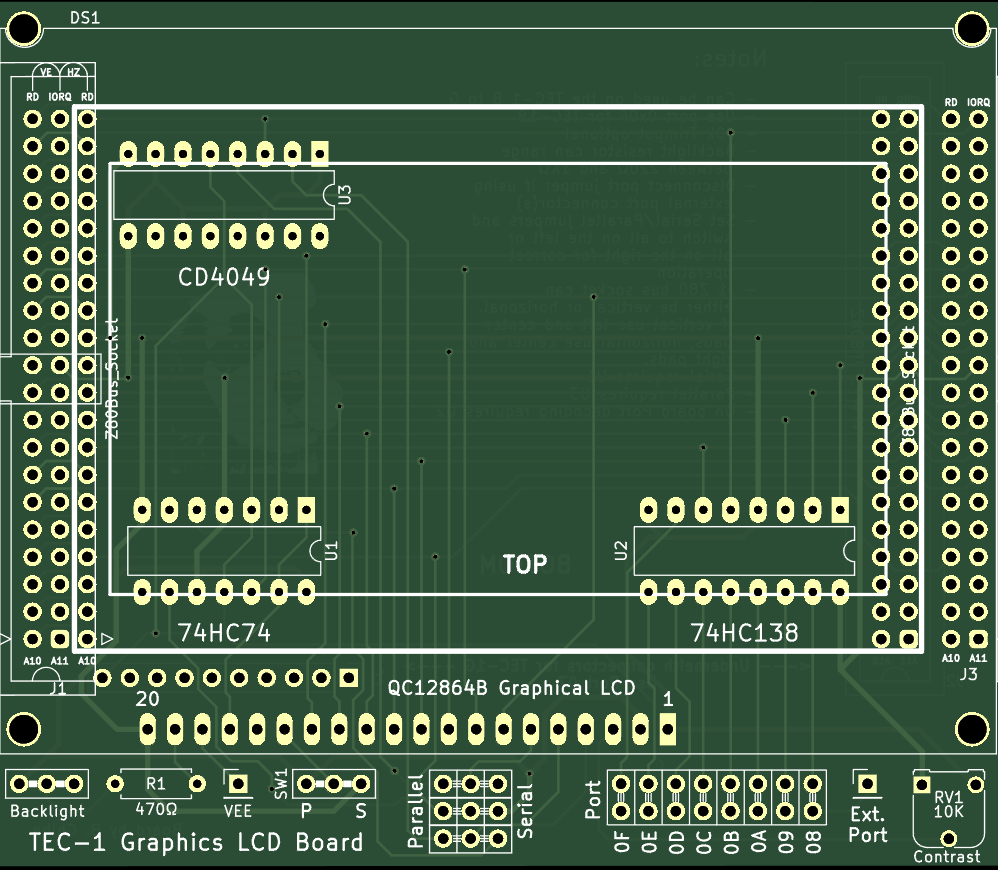
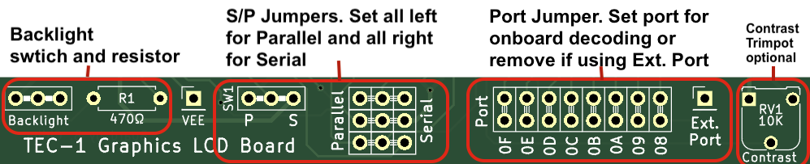
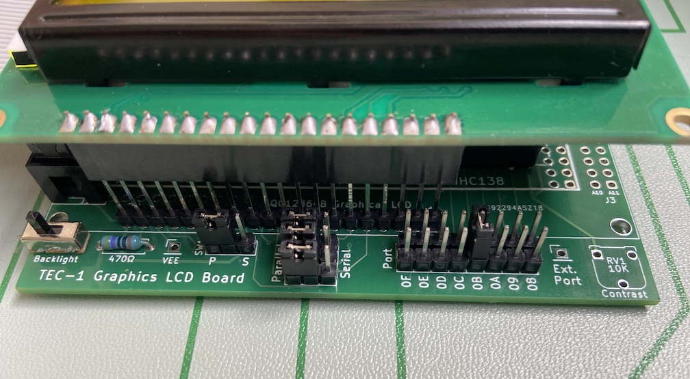

# LCD Add-On PCB for the TEC-1F

This is the board that I designed to help with connecting the LCD Screen to the TEC-1 computer.  It uses a 40pin Z80 Bus connector on either side.  It can connect to any TEC Computer.  Not all components are needed, it depends on how the board is connected.

This folder contains the Gerber file for PCB Manufacturing and the Schematic for reference.

## Configuration Settings

__NOTES:__
- Can be used on the TEC-1 B to F
- Use port 0x0F for TEC-1B
- 10k Trimpot optional
- Backlight resistor can range between 220Ω and 1KΩ
- Disconnect port jumper if using external port connector(s)
- Set Serial/Parallel jumpers and switch to all on the left or all on the right for correct operation
- J1 Z80 bus socket can either be vertical or horizontal. If vertical use left and center pads, horizontal use center and right pads.
- Serial requires U1
- Parallel requires U3
- On board Port decoding requires U2
- Underneath connectors for the TEC-1G work but a newer board has been designed for the 1G.  I suggest get that board instead.

This pictures shows the board set up using Parallel Communication (4 jumpers to the left), and On board port decoding set to `0B`.  Also the LCD Board is connected to long male headers for easy removal.
